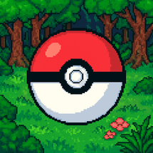
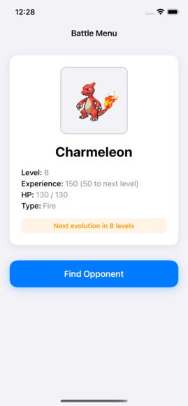

# 

## App Description
A Pokemon battle game app that lets you choose your starting pokemon, level up, evolve it, and battle wild Pokemons from 1st Generation

## Demo Video

## Design Pattern

**MVVM + Coordinator Pattern**
- ViewModels manage business logic and state
- Coordinators handle navigation between screens
- Services layer handles data operations
- Protocol-oriented

## Architecture

**Three-Layer Architecture:**
- **Presentation Layer**: UIKit ViewControllers + SwiftUI battle interface
- **Business Logic Layer**: Services and ViewModels
- **Data Layer**: Core Data persistence + PokeAPI network calls

## Key Technical Decisions

- **Swift Concurrency**: async/await for all network operations
- **Core Data**: Player progress and game persistence  
- **Hybrid UI**: UIKit for navigation, and SwiftUI View using
- **Image Caching**: Caching for images
- **Network Retry Logic**: Exponential backoff (1s, 2s, 3s) with 50% failure simulation
- **SwiftLint**: Code quality and style enforcement in all project
- **DocC Documentation**: Comprehensive documentation for service layer and core models

## Testing using XCTest
Meaningful Tests:
- **BattleServiceTests (Unit Test)**: Damage calculation validation for normal and critical hits
- **MoveGeneratorTests (Unit Test**: Type-specific move generation and fallback logic
- **NetworkServiceTests (Unit Test**: Pokemon API response decoding with real data
- **PokemonBattleUITests (UI Test)**: Starter selection flow and UI interaction testing

## Features

- **Starter Selection**: Choose from 3 starter Pokemon
- **Turn-Based Combat**: 4 moves per Pokemon with damage calculation
- **Experience System**: Gain XP to level up (50 XP per victory)
- **Pokemon Evolution**: Automatic evolution at levels 8 and 16

## Game Mechanics

**Battle System:**
- Each Pokemon has 4 moves (3 type-specific + Rest)
- Damage = move power + random bonus (0-10)
- 10% critical hit chance (1.5x damage)
- Rest move heals 30 HP (once per battle)
- Battle ends when one Pokemon reaches 0 HP

**Leveling:**
- Start at level 5 with chosen starter
- Gain 50 experience per victory
- HP scales with level: 100 + ((level - 5) × 10)

## Evolution System

Pokemon automatically evolve when they reach specific levels:
- **Level 8**: First evolution (Bulbasaur → Ivysaur)
- **Level 16**: Final evolution (Ivysaur → Venusaur)

Evolution updates Pokemon sprite, name, and ID while keeping level and experience.

## Setup Instructions

1. **Clone**: `git clone https://github.com/panaze/PokemonBattle`
2. **Open**: `open PokemonBattle.xcodeproj`
3. **Run**: Select iPhone simulator with at least iOS 17 and press ⌘+R
4. **Test**: Press ⌘+U to run unit tests
